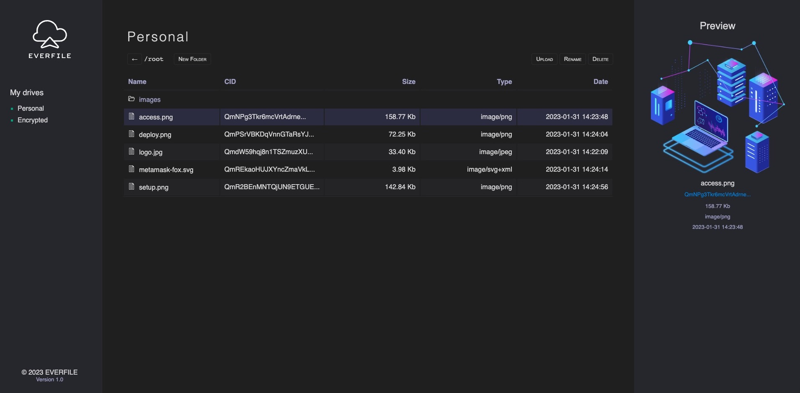

# EVERFILE

## Store your files permanently in FileCoin blockchain

## Concept

EverFile allows you to save files permanently in FileCoin blockchain using a contract in FVM that saves the tree structure of all CIDs of files uploaded to IFPS so you can have an ordered view of your drives.

From there you can preview and download your files, also encrypt and decrypt in your own secure drive so nobody can see what you are storing in EverFile, not even us!

## Tools

EverFile was built using the following tools:

- NodeJS for server and api requests
- Lighthouse SDK for easy storage to IPFS
- PostgreSQL for blockchain replication
- Solidity for smart contracts
- HTML, CSS, JS for web app UI

Visit us at [https://everfile.cloud](https://everfile.cloud)

* Hyperspace Testnet while under construction